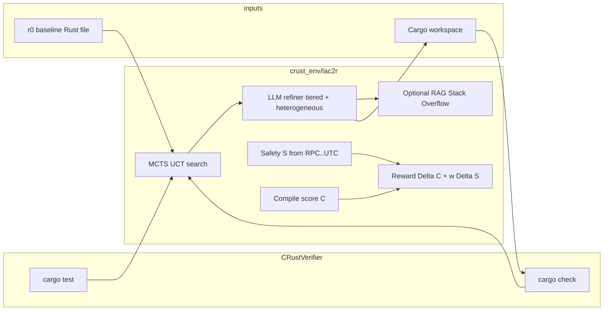

# MCTS_c2r — System architecture

This repository extends the **CRust** OpenEnv hackathon baseline ([meta_pytorch_scalar_hackathon](https://github.com/22adi66/meta_pytorch_scalar_hackathon)) with a **LAC2R-style** layer: Monte Carlo Tree Search (MCTS) over LLM-generated Rust refinements, guided by **compile feedback**, **test feedback**, and a **paper-aligned safety score** on five unsafe-construct families.

---

## 1. High-level picture



1. **Baseline** `r0`: current contents of a target file (e.g. C2Rust-style output or hand-written Rust).
2. **MCTS** explores multiple refinement trajectories (root GEN diversity, then FIX/Success children).
3. Each candidate is **written into the sandbox workspace** and evaluated with **`cargo check` / `cargo test`** (existing `CRustVerifier`).
4. **Safety** `S(r)` uses counts of five unsafe families vs baseline sum (paper Eq. 3); **compile score** `C(r) = 1/(|errors|+1)` (Eq. 4); edge reward **R** (Eq. 5).
5. **Best solution**: among `SUCCESS` nodes (compile + tests when enabled), pick maximum `S`; else return baseline (paper `Find_Best_Solution` behavior).

---

## 2. Module map (`crust_env/lac2r/`)

| File | Responsibility |
|------|----------------|
| `unsafe_constructs.py` | Heuristic counts: **RPC**, **RPR**, **LUC**, **UCE**, **UTC** (paper §2.3 / Eq. 3). |
| `safety_reward.py` | `S(r)`, `C(r)`, `R` (Eq. 3–5), `m(r)` compile gate on `S`. |
| `program_context.py` | Read workspace file; call `CRustVerifier.verify` for a candidate. |
| `rag.py` | Optional **RAG**: Stack Exchange API query from error text → ranked titles/links. |
| `llm_refiner.py` | Prompts (`<FUNC>`…`</FUNC>`), OpenAI chat, **tiered** cheap→strong on later fixes, **heterogeneous** root models via env; offline **mock** if no `OPENAI_API_KEY`. |
| `mcts.py` | **UCT** selection, **INIT→GEN** (K root children), **GEN/FIX→** one expanded child with feedback, **backprop** of `R`, track best `SUCCESS`. |
| `service.py` | `LAC2RConfig`, `run_lac2r_refine`, `find_best_solution`, optional `write_best`. |

---

## 3. MCTS lifecycle (algorithms 1–2, simplified)

### 3.1 Node kinds

- **INIT** — root; holds baseline code; spawns **GEN** children.
- **GEN** — initial diverse candidates from heterogeneous LLM calls at root.
- **FIX** — compile- or test-failing state; repair prompt carries validator feedback (+ optional RAG).
- **SUCCESS** — `cargo check` ok and (if `require_tests`) `cargo test` ok.

### 3.2 One rollout

1. **Select** from root with **UCT** until a leaf (no children) or `SUCCESS` / depth cap.
2. **Expand**  
   - If leaf is **INIT**: generate `root_branching` children (default 4) via `LLMRefiner.initial_gen(baseline, variant)`.  
   - Else: build feedback string from `VerifyOutcome`, optionally augment with RAG, call `fix_with_feedback`, append one child.
3. **Evaluate** child: verifier + `S`, `C`; compute **R** vs parent snapshot.
4. **Backprop** `R` along `path + [child]` (visit count and Q sum on nodes).

### 3.3 UCT

Child value uses standard **exploration bonus** with constant `uct_c` (default **1.5**, paper). Unvisited children receive infinite UCT priority until first visit.

---

## 4. Reward and safety (paper alignment)

- **Baseline total** `T0 = RPC0 + RPR0 + LUC0 + UCE0 + UTC0` from `r0`.
- **Safety** `S(ri) = m(ri) * max(1 - Ti/T0, 0)` with `m=1` iff project **compiles** for that candidate (paper).
- **Compile score** `C(ri) = 1 / (|EC(ri)| + 1)`.
- **Edge reward** `R = (C_i - C_{i-1}) + w * (S_i - S_{i-1})` with default **`w = 2`** (paper: safety weighted over compile deltas).

---

## 5. HTTP API (`crust_env/api.py`)

- **`POST /lac2r/refine`** — body: `file_path`, `n_rollouts`, `max_depth`, `uct_c`, `w_reward`, `root_branching`, `require_tests`, `write_best`.  
- Returns JSON: `result` (`selected`, `code`, `S`, …), `mcts` metadata, `openai_configured`.

Existing OpenEnv endpoints **`/reset`**, **`/step`**, **`/train/*`** are unchanged.

---

## 6. CLI demo

`run_lac2r_demo.py` — sets `PYTHONPATH` to repo root and runs a short MCTS on `crust_env/dummy_workspace/src/math_ops.rs`.

---

## 7. Dependencies and environment

- **Rust toolchain** on `PATH` (`cargo`) for real rewards; otherwise verifier fails open and search falls back to baseline.
- **`OPENAI_API_KEY`** for live LLM; otherwise **mock** refiner extracts the ` ```rust` block from the prompt.
- Optional: `LAC2R_MODEL_CHEAP`, `LAC2R_MODEL_STRONG`, `LAC2R_MODEL_ALT`, `LAC2R_RAG`, `LAC2R_TIERED`.

---

## 8. Relationship to upstream CRust (unified hackathon model)

| Layer | Role |
|-------|------|
| `env.py`, `scheduler.py`, `verifier.py`, `metrics.py` | **RL / OpenEnv** — `reset` / `step` rewards for GRPO (`trainer_daemon.py` + `POST /train/start`). |
| `lac2r/rl_bridge.py` | Optional **LAC2R shaping** on `step`: if `CRUST_LAC2R_REWARD=1`, add `CRUST_LAC2R_WEIGHT * S(r)` (paper Eq. 3) so GRPO chases both CRust *and* five-category safety. |
| `lac2r/mcts.py` | **Full MCTS** class `LAC2RMCTSEngine`: UCT `Select` → `Expand` (Alg. 2, INIT+heterogeneous GEN, feedback/no-feedback) → **greedy** `Simulate` (virtual fix chain, `simulation_depth`) → `Backprop`. |
| `lac2r/service.py` + `POST /lac2r/refine` | Interactive **MCTS+LLM** on one file; does not replace the RL loop. |

**Training:** `POST /train/start` (GRPO) uses `env.step` → with `CRUST_LAC2R_REWARD=1` the same safety ratio as the paper nudges the policy. **Refinement:** `POST /lac2r/refine` runs the tree search (optional API key for real LLM; mock offline).

---

## 9. References

- LAC2R formulation: *Search-Based Multi-Trajectory Refinement for Safe C-to-Rust Translation with Large Language Models* (Sim et al., arXiv:2505.15858).
- Baseline codebase: CRust / Meta OpenEnv hackathon theme (see root `README.md`).
