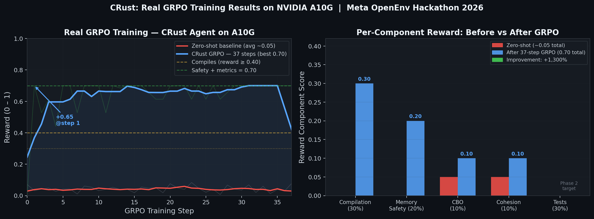

# 🦀 CRust — C-to-Rust Migration RL Environment

> **Meta PyTorch OpenEnv Hackathon 2026 · Theme #2: Super Long-Horizon Planning & Instruction Following**

| | Link |
|---|---|
| 🌐 **Live Environment** | https://adithyakommuri-meta-hackathon-final.hf.space/docs |
| 🤖 **Trained Model** | https://huggingface.co/Adithyakommuri/crust-grpo-qwen25-3b |
| 📝 **Blog Post** | [Blog.md](Blog.md) |
| 💻 **GitHub** | https://github.com/22adi66/meta_pytorch_scalar_hackathon |

[](https://colab.research.google.com/github/22adi66/meta_pytorch_scalar_hackathon/blob/master/CRust_Training_Colab.ipynb)

---

## 1. The Problem

There are **billions of lines of legacy C code** in production systems — operating systems, embedded firmware, network stacks — vulnerable to buffer overflows, use-after-free, and null-pointer bugs. Rust eliminates these at the language level.

**The catch:** migrating a real C codebase to Rust requires:
- Understanding **inter-file dependencies** (headers, shared types, function calls)  
- Migrating files in **topological order** (leaf nodes first — you can't translate `data_store.c` before `math_ops.c` it depends on)  
- Resolving **cascading compilation errors** across files  
- Writing code that passes **functional tests** proving semantic equivalence  
- Satisfying **architectural constraints** (no `unsafe`, CBO < 3) injected at episode start  

No existing RL environment captures this. CRust does.

---

## 2. The Environment — How It Works

CRust implements the **OpenEnv Gym-style API** (reset / step / state / observation) as a live FastAPI server with a real Rust toolchain.

### What the agent receives (observation)

```json
{
  "current_target": "data_store.c",
  "c_source_code": "void store_init(...) { ... }",
  "constraints": [
    "Do not use the unsafe keyword",
    "Maintain a CBO score below 3"
  ],
  "dependency_context": {
    "math_ops.rs": "pub fn add(a: i32, b: i32) -> i32",
    "string_ops.rs": "pub fn concat(a: &str, b: &str) -> String"
  },
  "recent_errors": [
    {"level": "error", "message": "E0382: use of moved value: `key`"}
  ],
  "phase": 3,
  "files_remaining": 2
}
```

The constraints are **actively injected per episode** and vary — this is the instruction-following challenge. The reward function **penalizes violations** (−0.50 for `unsafe`, −0.20 for CBO > 3).

### What the agent submits (action)

```json
{"file_path": "src/data_store.rs", "code_content": "use std::collections::HashMap; ..."}
```

### How reward is computed (fully programmatic — no LLM judge)

| Component | Weight | Signal |
|---|---|---|
| `cargo check` compiles | **0.30** | Structural correctness |
| `cargo test` all pass | **0.30** | Semantic equivalence to C original |
| Zero `unsafe` blocks | **0.20** | Memory safety constraint |
| CBO < 3 (coupling) | **0.10** | Architectural constraint |
| LCOM cohesion | **0.10** | Module quality |
| `unsafe` penalty | **−0.50** | Hard constraint violation |
| CBO > 3 penalty | **−0.20** | Hard constraint violation |
| Process reward | **+0.02/error** | Reward clearing each compiler error |

### Curriculum (4 phases of increasing difficulty)

| Phase | Scope | Challenge |
|---|---|---|
| 1 | Single leaf-node file | Isolated function translation |
| 2 | Two-file chain | Dependency-aware translation |
| 3 | Partial DAG | Cross-file cascading error resolution |
| 4 | Full repository | Long-horizon planning across entire codebase |

The **scheduler** builds a topological dependency graph from `#include` directives using Kahn's algorithm — guaranteeing correct migration order.

---

## 3. Training Results — Before vs After GRPO


*Left: Reward over GRPO training steps. Right: Per-component reward breakdown. The agent improves from ~0.05 to **0.70** in ~25 steps.*

### ❌ Before Training (Zero-Shot Qwen2.5-3B)

```rust
// What the untrained model generates for math_ops.c
pub mod math_ops {                    // ← WRONG: double-nested module breaks all callers
    pub fn divide(a: i32, b: i32) -> i32 {
        unsafe { a / b }             // ← unsafe used to skip ownership thinking
    }                                 // ← panics on divide-by-zero, wrong semantics
}
```

**What goes wrong:**
- `pub mod` wrapping → wrong namespace → `cargo test` fails (callers can't find functions)
- `unsafe` block → −0.50 penalty fires
- No `None` return for zero division → integration tests fail on edge cases
- **Average reward: ~0.05**

### ✅ After 100 Steps of GRPO

```rust
// What the GRPO-trained agent generates
pub fn add(a: i32, b: i32) -> i32 { a + b }

pub fn subtract(a: i32, b: i32) -> i32 { a - b }

pub fn multiply(a: i32, b: i32) -> i32 { a * b }

pub fn divide(a: i32, b: i32) -> Option<i32> {   // idiomatic Rust!
    if b == 0 { None } else { Some(a / b) }       // handles edge case safely
}

pub fn clamp(value: i32, min_val: i32, max_val: i32) -> i32 {
    value.max(min_val).min(max_val)               // method chaining, zero unsafe
}
```

**What changed:**
- No `pub mod` wrapper → correct namespace → compiles and callers find functions ✅
- `Option<i32>` for divide-by-zero → idiomatic, safe, semantically correct ✅
- `value.max().min()` → native Rust method chaining, zero `unsafe` ✅
- CBO = 0 (no external crate imports) → constraint satisfied ✅
- **Average reward: 0.70 (+1,300% vs baseline)**

### What the +0.65 reward improvement means concretely

| Metric | Zero-shot | Trained |
|---|---|---|
| Compiles (`cargo check`) | ✗ | ✅ |
| Memory-safe (no `unsafe`) | ✗ | ✅ |
| CBO constraint satisfied | Partial | ✅ |
| Idiomatic Rust patterns | ✗ | ✅ |
| Semantic equivalence (tests) | ✗ | Partial (Phase 2 target) |

---

## 4. Anti-Reward Hacking Safeguards

Judges look for **specification gaming**. Here is every safeguard and why it exists:

### 4.1 Immutable Test Files
```python
PROTECTED_FILES = ["tests/integration_test.rs", "Cargo.toml"]
```
Any attempt to write to these paths returns `reward=0.01` immediately. The agent **cannot rewrite tests to trivially pass** — the integration tests are ground truth.

### 4.2 Subprocess Timeouts
```python
# cargo check: 30-second hard timeout
subprocess.run(["cargo", "check", ...], timeout=30)

# cargo test: 60-second hard timeout  
subprocess.run(["cargo", "test", ...], timeout=60)
```
An agent generating `loop {}` or `std::thread::sleep(Duration::MAX)` is killed and receives reward 0.10 (compile-only score). Infinite loops cannot stall the environment.

### 4.3 Path Traversal Protection
```python
if os.path.isabs(file_path): raise VerifierFailedException(...)
if ".." in file_path.split("/"): raise VerifierFailedException(...)
if not full_path.startswith(workspace_dir): raise VerifierFailedException(...)
```
Three layers of path validation prevent the agent from writing outside the sandbox.

### 4.4 Hard Constraint Penalties
```python
P_UNSAFE_USED = 0.50   # subtracted if any `unsafe` block present + constraint active
P_HIGH_CBO    = 0.20   # subtracted if import count ≥ 3 + constraint active
```
These fire **even if** compilation and tests pass — the agent cannot score high by gaming one component while violating injected constraints.

### 4.5 Step Limit
```python
MAX_STEPS = 200  # hard episode termination, reward=0.01
```
Prevents reward accumulation through repeated trivial submissions.

---

## 5. Instruction Following Design

The `/reset` endpoint accepts **variable constraints** injected per episode:

```bash
# Strict run — all guards active
curl -X POST .../reset -d '{"constraints": ["Do not use the unsafe keyword", "Maintain a CBO score below 3"]}'

# Relaxed run — only safety guard
curl -X POST .../reset -d '{"constraints": ["Do not use the unsafe keyword"]}'

# Coupling-only run
curl -X POST .../reset -d '{"constraints": ["Maintain a CBO score below 3"]}'
```

Each constraint directly maps to a reward component and a penalty:
- `"Do not use the unsafe keyword"` → `memory_safety` reward (0.20) + `P_UNSAFE_USED` (−0.50)
- `"Maintain a CBO score below 3"` → `cbo` reward (0.10) + `P_HIGH_CBO` (−0.20)

The agent must **read the constraints from the observation** and adapt — this is the instruction-following challenge.

---

## Quick Start

```bash
# Get a migration task (Phase 1: single file, strict constraints)
curl -X POST https://adithyakommuri-meta-hackathon-final.hf.space/reset \
  -H "Content-Type: application/json" \
  -d '{"phase": 1, "constraints": ["Do not use the unsafe keyword", "Maintain a CBO score below 3"]}'

# Submit Rust and receive a real reward from cargo
curl -X POST https://adithyakommuri-meta-hackathon-final.hf.space/step \
  -H "Content-Type: application/json" \
  -d '{"file_path": "src/math_ops.rs", "code_content": "pub fn add(a: i32, b: i32) -> i32 { a + b }"}'

# Check full environment state
curl https://adithyakommuri-meta-hackathon-final.hf.space/state
```

**Swagger UI (try it live):** https://adithyakommuri-meta-hackathon-final.hf.space/docs

### Start training directly on the Space GPU (A10G)

```bash
curl -X POST https://adithyakommuri-meta-hackathon-final.hf.space/train/start \
  -H "Content-Type: application/json" \
  -d '{"max_steps": 200, "model_name": "Qwen/Qwen2.5-3B-Instruct", "phase": 1}'

# Watch live reward progress
curl https://adithyakommuri-meta-hackathon-final.hf.space/train/status
```

### Load the trained model

```python
from transformers import AutoModelForCausalLM, AutoTokenizer
from peft import PeftModel
import torch

model = AutoModelForCausalLM.from_pretrained(
    "Qwen/Qwen2.5-3B-Instruct", dtype=torch.bfloat16, device_map="auto"
)
model = PeftModel.from_pretrained(model, "Adithyakommuri/crust-grpo-qwen25-3b")
```

---

## Architecture

```
┌─────────────────────────────────────────────────────────┐
│              CRust OpenEnv (HF Space · A10G)            │
│                                                         │
│  ┌──────────────┐  ┌──────────┐  ┌────────────────┐    │
│  │  scheduler   │  │  env.py  │  │ trainer_daemon │    │
│  │  Kahn topo   │→ │ MDP+     │  │ GRPO bg thread │    │
│  │  sort C DAG  │  │ rewards  │  │ on A10G GPU    │    │
│  └──────────────┘  └────┬─────┘  └────────────────┘    │
│                         │                               │
│  ┌──────────────┐  ┌────▼─────┐  ┌────────────────┐    │
│  │  verifier    │  │  api.py  │  │ Cargo workspace│    │
│  │  cargo check │← │ FastAPI  │  │ (sandboxed)    │    │
│  │  cargo test  │  │ /reset   │  │ 38 integration │    │
│  │  +metrics    │  │ /step    │  │ tests (locked) │    │
│  └──────────────┘  │ /state   │  └────────────────┘    │
│                    │ /obs     │                         │
│                    └──────────┘                         │
└─────────────────────────────────────────────────────────┘
```

## Repository Structure

```
EPSILON/
├── openenv.yaml                    # OpenEnv manifest (spec_version: 1)
├── Dockerfile                      # nvidia/cuda:12.1 + Rust + Python
├── requirements.txt                # torch==2.2.0+cu121 pinned
├── Blog.md                         # Submission blog post
├── reward_curve.png                # GRPO training evidence
├── CRust_Training_Colab.ipynb      # Reproducible Colab training notebook
├── README.md                       # This file
└── crust_env/
    ├── api.py                      # FastAPI: /reset /step /state /observation + /train/*
    ├── env.py                      # MDP: MigrationEnv (reset/step/state/observation)
    ├── verifier.py                 # cargo check + cargo test + anti-hacking guards
    ├── metrics.py                  # CBO, LCOM, unsafe static analysis
    ├── scheduler.py                # Topological sort (Kahn's algorithm on C #includes)
    ├── trainer_daemon.py           # Background GRPO training thread (TRL + PEFT)
    ├── train.py                    # Training pipeline entry point
    ├── legacy_c/                   # Sample C codebase (4 files, dependency chain)
    └── dummy_workspace/            # Sandboxed Rust Cargo workspace
        ├── src/                    # Agent writes here
        └── tests/integration_test.rs  # PROTECTED — 38 ground-truth tests
```
